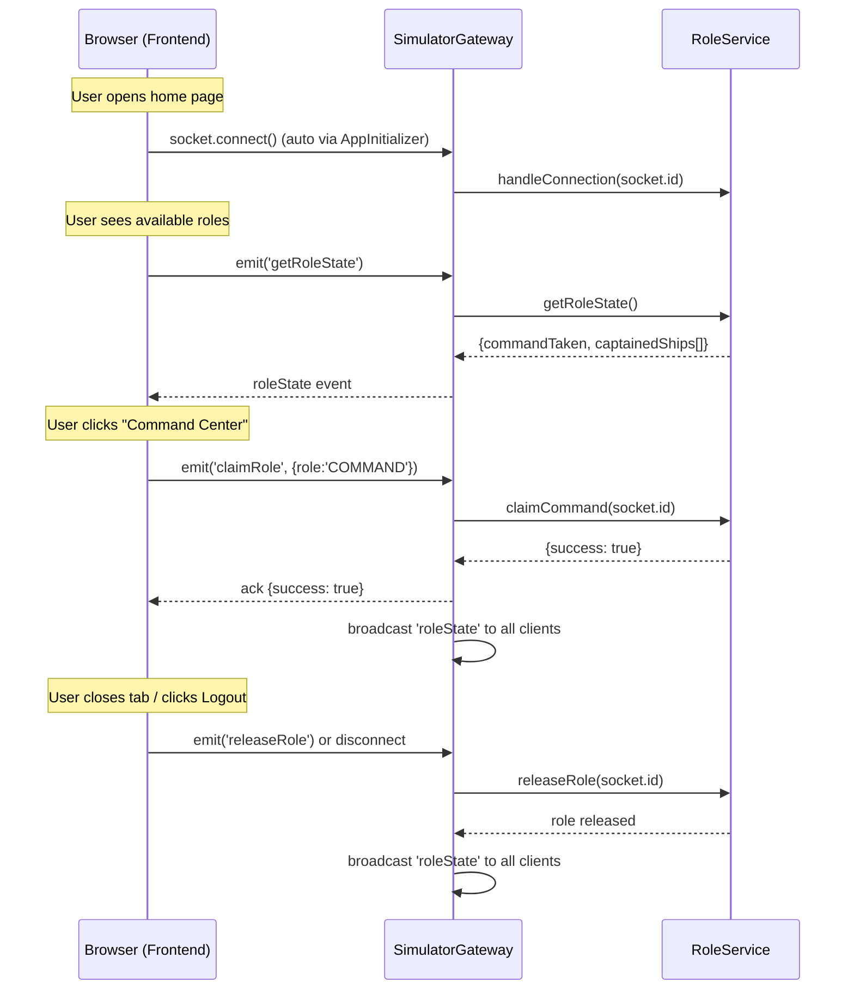

# Multi-Role Operations System with Exclusive Position Locking

## Goal
Implement server-enforced, exclusive role locking so that only one user can hold the **Command** role at a time, and only one user can captain each individual ship. Roles are tied to WebSocket connections (Socket.IO socket IDs) — disconnecting (tab close, explicit logout) immediately releases the role. All clients receive real-time role state updates.

## User Review Required

> [!IMPORTANT]
> **Identity model**: We're using the **Socket.IO socket ID** as the session identity. This means each browser tab is an independent session. Refreshing a page creates a new socket connection and will release the previous role. This is the simplest approach but means a page refresh loses your role (you'd need to re-claim it on the home page). If you want persistence across refreshes, we'd need `sessionStorage` + auth tokens — but that adds significant complexity.

> [!WARNING]
> **TopBar changes**: The Command/Captain toggle buttons will be **completely removed** from the TopBar and replaced with a static role badge + Log Out button. The Captain ship-selector dropdown will also be removed — Captains are locked to the ship chosen on the home page.

## Architecture Overview



---

## Proposed Changes

### Component 1: Backend — New `RoleService`

#### [NEW] `src/simulator/roles/role.service.ts`

A new injectable NestJS service responsible for tracking which socket IDs hold which roles. Pure in-memory state — no database needed.

```typescript
import { Injectable, Logger } from '@nestjs/common';

export interface RoleState {
  /** Socket ID of the user holding Command, or null if unclaimed */
  commandHolder: string | null;
  /** Map of shipId → socket ID for each captained ship */
  captainedShips: Record<string, string>;
}

@Injectable()
export class RoleService {
  private readonly logger = new Logger(RoleService.name);

  /** Socket ID → 'COMMAND' | 'CAPTAIN' */
  private sessionRoles = new Map<string, { role: 'COMMAND' | 'CAPTAIN'; shipId?: string }>();

  private commandHolder: string | null = null;
  private captainedShips = new Map<string, string>(); // shipId → socketId

  /**
   * Returns a snapshot of current role availability for broadcasting.
   */
  getRoleState(): RoleState {
    return {
      commandHolder: this.commandHolder,
      captainedShips: Object.fromEntries(this.captainedShips),
    };
  }

  claimCommand(socketId: string): { success: boolean; error?: string } {
    if (this.sessionRoles.has(socketId)) {
      return { success: false, error: 'You already hold a role. Log out first.' };
    }
    if (this.commandHolder !== null) {
      return { success: false, error: 'Command role is already taken by another user.' };
    }
    this.commandHolder = socketId;
    this.sessionRoles.set(socketId, { role: 'COMMAND' });
    this.logger.log(`[ROLE] Command claimed by socket ${socketId}`);
    return { success: true };
  }

  claimCaptain(socketId: string, shipId: string): { success: boolean; error?: string } {
    if (this.sessionRoles.has(socketId)) {
      return { success: false, error: 'You already hold a role. Log out first.' };
    }
    if (this.captainedShips.has(shipId)) {
      return { success: false, error: `Ship ${shipId} already has a captain.` };
    }
    this.captainedShips.set(shipId, socketId);
    this.sessionRoles.set(socketId, { role: 'CAPTAIN', shipId });
    this.logger.log(`[ROLE] Captain of ${shipId} claimed by socket ${socketId}`);
    return { success: true };
  }

  releaseRole(socketId: string): void {
    const entry = this.sessionRoles.get(socketId);
    if (!entry) return;

    if (entry.role === 'COMMAND') {
      this.commandHolder = null;
      this.logger.log(`[ROLE] Command released by socket ${socketId}`);
    } else if (entry.role === 'CAPTAIN' && entry.shipId) {
      this.captainedShips.delete(entry.shipId);
      this.logger.log(`[ROLE] Captain of ${entry.shipId} released by socket ${socketId}`);
    }
    this.sessionRoles.delete(socketId);
  }

  getSessionRole(socketId: string) {
    return this.sessionRoles.get(socketId) || null;
  }
}
```

**Key design decisions:**
- `sessionRoles` map tracks which role each socket holds (for fast lookup on disconnect)
- `commandHolder` is a single string (only one Command allowed)
- `captainedShips` maps `shipId → socketId` (one captain per ship)
- `claimCommand` / `claimCaptain` enforce mutual exclusivity per socket AND per role

---

### Component 2: Backend — Gateway Updates

#### [MODIFY] `simulator.gateway.ts`

Add WebSocket lifecycle hooks and role-related message handlers.

```diff
 import {
+  ConnectedSocket,
   MessageBody,
+  OnGatewayConnection,
+  OnGatewayDisconnect,
   SubscribeMessage,
   WebSocketGateway,
   WebSocketServer,
 } from '@nestjs/websockets';
-import { Server } from 'socket.io';
+import { Server, Socket } from 'socket.io';
 import { SimulatorService, RestrictidAreaType } from './simulator.service';
 import { Logger } from '@nestjs/common';
 import { ShipRoutingService } from '../ship-routing/ship-routing.service';
 import { AlertsService } from './alerts/alerts.service';
+import { RoleService } from './roles/role.service';

 @WebSocketGateway({ cors: true })
-export class SimulatorGateway {
+export class SimulatorGateway implements OnGatewayConnection, OnGatewayDisconnect {
   @WebSocketServer()
   server: Server;
   private readonly logger = new Logger(SimulatorGateway.name);

   constructor(
     private readonly simulatorService: SimulatorService,
     private readonly shipRoutingService: ShipRoutingService,
     private readonly alertsService: AlertsService,
+    private readonly roleService: RoleService,
   ) {
     // existing subscriptions ...
   }

+  handleConnection(client: Socket) {
+    this.logger.log(`Client connected: ${client.id}`);
+  }
+
+  handleDisconnect(client: Socket) {
+    this.logger.log(`Client disconnected: ${client.id}`);
+    this.roleService.releaseRole(client.id);
+    // Broadcast updated role state to all remaining clients
+    this.server?.emit('roleState', this.roleService.getRoleState());
+  }
+
+  @SubscribeMessage('getRoleState')
+  handleGetRoleState() {
+    return this.roleService.getRoleState();
+  }
+
+  @SubscribeMessage('claimRole')
+  handleClaimRole(
+    @ConnectedSocket() client: Socket,
+    @MessageBody() data: { role: 'COMMAND' | 'CAPTAIN'; shipId?: string },
+  ) {
+    let result;
+    if (data.role === 'COMMAND') {
+      result = this.roleService.claimCommand(client.id);
+    } else if (data.role === 'CAPTAIN' && data.shipId) {
+      result = this.roleService.claimCaptain(client.id, data.shipId);
+    } else {
+      result = { success: false, error: 'Invalid role or missing shipId for Captain' };
+    }
+
+    if (result.success) {
+      // Broadcast updated role state to ALL clients
+      this.server?.emit('roleState', this.roleService.getRoleState());
+    }
+    return result;
+  }
+
+  @SubscribeMessage('releaseRole')
+  handleReleaseRole(@ConnectedSocket() client: Socket) {
+    this.roleService.releaseRole(client.id);
+    this.server?.emit('roleState', this.roleService.getRoleState());
+    return { success: true };
+  }

   // ... existing handlers unchanged ...
 }
```

**Key points:**
- `OnGatewayConnection` / `OnGatewayDisconnect` lifecycle hooks auto-release roles on tab close
- `claimRole` validates and locks the role server-side, then broadcasts `roleState` to all clients
- `releaseRole` explicitly releases (used by the Log Out button)
- `getRoleState` lets a newly connected client query current availability

---

### Component 3: Backend — Module Registration

#### [MODIFY] `simulator.module.ts`

```diff
+import { RoleService } from './roles/role.service';

 @Module({
   controllers: [SimulatorController],
   providers: [
     SimulatorService,
     SimulatorGateway,
     ShipRoutingService,
     PortsService,
     AlertsService,
+    RoleService,
   ],
-  exports: [SimulatorService, AlertsService],
+  exports: [SimulatorService, AlertsService, RoleService],
 })
```

---

### Component 4: Frontend — New `roleStore` Rewrite

#### [MODIFY] `src/stores/role.ts`

Complete rewrite to track server-side role state and manage claiming/releasing roles.

```typescript
import { create } from "zustand";

export enum Role {
  COMMAND = "COMMAND",
  CAPTAIN = "CAPTAIN",
}

/** Server-broadcasted role availability */
export interface ServerRoleState {
  commandHolder: string | null;
  captainedShips: Record<string, string>; // shipId → socketId
}

interface RoleState {
  role: Role | null;
  captainShipId: string | null;

  /** Server role availability (updated in real-time) */
  serverRoleState: ServerRoleState | null;

  setRole: (role: Role, shipId?: string | null) => void;
  clearRole: () => void;
  setServerRoleState: (state: ServerRoleState) => void;

  // Computed helpers
  isCommandAvailable: () => boolean;
  isShipCaptainAvailable: (shipId: string) => boolean;
}

export const useRoleStore = create<RoleState>((set, get) => ({
  role: null,
  captainShipId: null,
  serverRoleState: null,

  setRole: (role, shipId = null) =>
    set({
      role,
      captainShipId: role === Role.CAPTAIN ? (shipId || null) : null,
    }),

  clearRole: () => set({ role: null, captainShipId: null }),

  setServerRoleState: (state) => set({ serverRoleState: state }),

  isCommandAvailable: () => {
    const s = get().serverRoleState;
    return s ? s.commandHolder === null : true;
  },

  isShipCaptainAvailable: (shipId: string) => {
    const s = get().serverRoleState;
    return s ? !(shipId in s.captainedShips) : true;
  },
}));
```

**Key changes:**
- Removed `setCommand()` / `setCaptain()` / `setCaptainShipId()` — replaced with a single `setRole(role, shipId?)`
- Added `serverRoleState` — a mirror of the server-broadcasted role availability
- Added `isCommandAvailable()` / `isShipCaptainAvailable(shipId)` — computed helpers the home page uses to conditionally show/disable role cards

---

### Component 5: Frontend — Socket Integration for Roles

#### [MODIFY] `src/stores/fleetStore.ts` — `initSocket()`

Add role-state event listeners alongside the existing fleet/alert listeners:

```diff
+import { useRoleStore } from "./role";

 // Inside initSocket(), after the existing socket.on handlers:

+// Listen for real-time role state broadcasts
+socket.on("roleState", (state: any) => {
+  useRoleStore.getState().setServerRoleState(state);
+});

 // On connect, also fetch current role availability
 socket.on("connect", () => {
   // ... existing code ...
+  // Fetch current role state
+  socket.emit("getRoleState", {}, (res: any) => {
+    if (res) {
+      useRoleStore.getState().setServerRoleState(res);
+    }
+  });
 });
```

---

### Component 6: Frontend — Home Page Rewrite

#### [MODIFY] `src/app/page.tsx`

Transform the home page to:
1. Show real-time role availability from the server
2. Disable/gray out unavailable roles
3. Claim roles via the socket before navigating

```typescript
"use client";

import { useState, useEffect } from "react";
import { useRouter } from "next/navigation";
import { useRoleStore, Role } from "@/stores/role";
import { useFleetStore } from "@/stores/fleetStore";
import { toast } from "sonner";

const REAL_SHIPS = [
  { id: "MV-1", name: "Aurora" },
  { id: "MV-2", name: "Borealis" },
  // ... all 15 ships ...
];

export default function Home() {
  const router = useRouter();
  const socket = useFleetStore((state) => state.socket);
  const serverRoleState = useRoleStore((state) => state.serverRoleState);
  const isCommandAvailable = useRoleStore((state) => state.isCommandAvailable);
  const isShipCaptainAvailable = useRoleStore((state) => state.isShipCaptainAvailable);
  const setRole = useRoleStore((state) => state.setRole);

  const [selectedShipId, setSelectedShipId] = useState("MV-1");
  const [claiming, setClaiming] = useState(false);

  const commandAvailable = isCommandAvailable();
  const captainAvailable = isShipCaptainAvailable(selectedShipId);

  const handleClaimCommand = () => {
    if (!socket || claiming) return;
    setClaiming(true);
    socket.emit("claimRole", { role: "COMMAND" }, (res: any) => {
      setClaiming(false);
      if (res?.success) {
        setRole(Role.COMMAND);
        router.push("/fleet");
      } else {
        toast.error(res?.error || "Failed to claim Command role");
      }
    });
  };

  const handleClaimCaptain = () => {
    if (!socket || claiming) return;
    setClaiming(true);
    socket.emit("claimRole", { role: "CAPTAIN", shipId: selectedShipId }, (res: any) => {
      setClaiming(false);
      if (res?.success) {
        setRole(Role.CAPTAIN, selectedShipId);
        router.push("/fleet");
      } else {
        toast.error(res?.error || "Failed to claim Captain role");
      }
    });
  };

  return (
    // UI renders Command card as disabled/grayed when commandAvailable is false
    // UI renders Captain card with ship selector, disabling ships that are already captained
    // The "Access Board" / "Enter Command" buttons call handleClaimCommand / handleClaimCaptain
  );
}
```

**Key behaviors:**
- Command card: shows "UNAVAILABLE — Active Commander" badge when `commandHolder !== null`
- Captain card: individual ships in the dropdown show "(Captained)" and are disabled when already taken
- Role is claimed server-side FIRST, then local state is set and navigation happens
- If claim fails (race condition), a toast error is shown and user stays on the home page

---

### Component 7: Frontend — TopBar Rewrite

#### [MODIFY] `src/components/topBar.tsx`

Remove the Command/Captain toggle buttons and the Captain ship-selector. Replace with:

```diff
-        {/* Command/Captain toggle */}
-        <div className="flex items-center bg-gray-900/50 ...">
-          <button onClick={() => setCommand()} ...>Command</button>
-          <button onClick={() => setCaptain()} ...>Captain</button>
-        </div>
+        {/* Static Role Badge */}
+        <div className="flex items-center gap-2 bg-gray-900/50 border border-gray-800 rounded-xl px-4 py-2">
+          <span className={`text-xs font-bold uppercase tracking-wider ${
+            role === "COMMAND" ? "text-blue-400" : "text-orange-400"
+          }`}>
+            {role === "COMMAND" ? "⚓ Command" : `🚢 Captain — ${shipName}`}
+          </span>
+        </div>
+
+        {/* Log Out Button */}
+        <button
+          onClick={handleLogout}
+          className="px-4 py-1.5 bg-red-950/40 border border-red-900/60 ... text-red-400 hover:bg-red-900/40"
+        >
+          <LogOut className="size-3.5" />
+          Log Out
+        </button>
```

The `handleLogout` function:
```typescript
const handleLogout = () => {
  const socket = useFleetStore.getState().socket;
  if (socket) {
    socket.emit("releaseRole", {}, () => {});
  }
  clearRole();       // Clear local Zustand state
  router.push("/"); // Navigate back to home page
};
```

**What's removed:**
- Command/Captain toggle buttons
- Captain ship-selector dropdown

**What's added:**
- Static role badge showing current role (and ship name for Captains)
- Log Out button that emits `releaseRole` and navigates to home

---

### Component 8: Frontend — Route Protection

#### [MODIFY] `src/app/fleet/layout.tsx`

Add a client-side guard that redirects to home if no role is set:

```typescript
"use client";
import { useEffect } from "react";
import { useRouter } from "next/navigation";
import { useRoleStore } from "@/stores/role";
// ... existing imports

export default function FleetLayout({ children }) {
  const role = useRoleStore((state) => state.role);
  const router = useRouter();

  useEffect(() => {
    if (!role) {
      router.replace("/");
    }
  }, [role, router]);

  if (!role) return null; // Avoid flash of fleet UI

  return (
    // ... existing layout JSX unchanged ...
  );
}
```

---

## Summary of All Files Changed

| File | Action | Description |
|------|--------|-------------|
| `simulator/src/simulator/roles/role.service.ts` | **NEW** | In-memory role tracking service |
| `simulator/src/simulator/simulator.gateway.ts` | MODIFY | Add connection/disconnect hooks, `claimRole`, `releaseRole`, `getRoleState` handlers |
| `simulator/src/simulator/simulator.module.ts` | MODIFY | Register `RoleService` as provider |
| `commandcentrefe/src/stores/role.ts` | MODIFY | Rewrite to track server role state + claim/release flow |
| `commandcentrefe/src/stores/fleetStore.ts` | MODIFY | Add `roleState` event listener in `initSocket()` |
| `commandcentrefe/src/app/page.tsx` | MODIFY | Server-backed role claiming with availability UI |
| `commandcentrefe/src/components/topBar.tsx` | MODIFY | Replace toggles with static badge + Log Out button |
| `commandcentrefe/src/app/fleet/layout.tsx` | MODIFY | Add role-based route guard |

---

## Verification Plan

### Automated Tests

```bash
# Backend: Run all existing tests + new RoleService tests
cd c:\Users\Azfar\Desktop\Codes\NestStuff\simulator
npx jest --runInBand

# Frontend: TypeScript check (no unit tests exist yet)
cd c:\Users\Azfar\Desktop\Codes\NextStuff\commandcentrefe
pnpm exec tsc --noEmit
```

A new test file `role.service.spec.ts` will be created to verify:
- Claiming Command when available → success
- Claiming Command when already taken → error
- Claiming Captain for available ship → success
- Claiming Captain for taken ship → error
- Claiming two roles from same socket → error
- Releasing role on disconnect → role becomes available
- `getRoleState()` returns accurate snapshot

### Manual Verification

1. **Single user flow**: Open home page → claim Command → see fleet page → log out → back to home with Command available again
2. **Multi-tab exclusivity**: Open two tabs. Claim Command in Tab 1. Tab 2 should show Command as unavailable. Close Tab 1 → Tab 2 should immediately see Command become available.
3. **Captain ship locking**: Tab 1 claims Captain of MV-1. Tab 2 should see MV-1 as unavailable in the ship dropdown. Tab 2 can still claim MV-2.
4. **Route guard**: Navigate directly to `/fleet` without a role → should redirect to home.
5. **TopBar**: Verify no toggle buttons exist, only role badge + Log Out.
